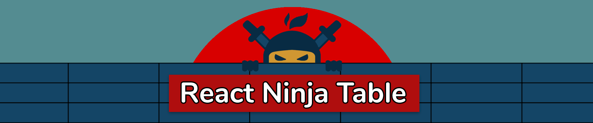

<div align="center">
  
</div>

<br>

<div align="center">

  [](https://www.npmjs.com/package/react-awesome-table)
  [](https://standardjs.com)
  [](https://travis-ci.com/hcorta/react-ninja-table)
  [](https://david-dm.org/hcorta/react-ninja-table)
  [](https://david-dm.org/hcorta/react-ninja-table?type=dev)
  [](https://opensource.org/licenses/MIT)
  [](http://makeapullrequest.com)
  
</div>

<div align="center">
  <p>A <strong>simple</strong> but <strong>powerful</strong> lightweight (6.4kB) table for React with <strong>highly-customizable</strong> options</p>
</div>

***
#### ⚠️🚧🚧 Currently in development stage 🚧🚧⚠️️️️
***

## Features
* Lightweight (6.4kb gziped - no dependencies)
* Auto out of the box, fully controllable API
* Headless (100% customizable, Bring-your-own-UI)
* Virtualization (no performance loss for long data lists)
* Easy-to-customize styling
* Sorting
* Pagination


## Install

```bash
yarn add react-ninja-table
```

## Usage
> Columns can be passed as array or components. Both cases are listed below.

### Simple use case

```jsx
import { Table, Column } from 'react-ninja-table'

function Example () {

    const data = [
        { name: 'Hugo', age: 30 },
        { name: 'John', age: 32 }
    ]

    const columns = [
        { header: 'Name', dataKey: 'name' },
        { header: 'Age', dataKey: 'age' }
    ]

    return (
        <Table data={data} columns={columns}/>
    )         
}
```

### Advanced use case

```jsx
import { Table, Column } from 'react-ninja-table'


function CustomCell({ cellData, ...restOfCellProps }) {
  return (
    <span>{cellData}</span>
  )
}

function CustomHeader({ cellData, ...restOfHeaderProps }) {
  return (
    <span>{cellData}</span>
  )
}

function customColumnSort({ a, b, sortBy, sortDirection }) {
  if (sortDirection === 'ASC') {
    if (a[sortBy] < b[sortBy]) return -1
    if (a[sortBy] > b[sortBy]) return 1
  } else {
    if (a[sortBy] < b[sortBy]) return 1
    if (a[sortBy] > b[sortBy]) return -1
  }
}

function Example () {
    const data = [
        { name: 'Hugo', genre: 'Male', age: 30, country: 'Spain' },
        { name: 'Helen', genre: 'Female', age: 32, country: 'France' },
        ...
    ]

    return (
        <Table
            id={'ninja-table'}
            className={'custom-table-class'}
            headerClassName={'custom-header-class'}
            rowClassName={'custom-row-class'}
            loading={loading}
            height={700}
            width={'100%'}
            data={data}
            rowHeight={20}
            headerHeight={25}
            overscanRowCount={50}
            virtualized={false}
            onRowClick={row => console.log('Row', row)}
            onCellClick={cell => console.log('Cell', cell)}
            onHeaderClick={header => console.log('Header', header)}
            onColumnSort={props => console.log(props)}
            noDataMessage={'There is no data to display'}
            noDataComponent={({ noDataMessage }) => <span>{noDataMessage}</span>}
           >
                <Column
                  header={'Name'}
                  width={'20%}
                  dataKey={'name'}
                  sortable={true}
                />
                <Column
                  header={'Genre'}
                  width={200}
                  dataKey={'genre'}
                  sortable={true}
                  columnSortMethod={customColumnSort}
                />
                <Column
                  header={CustomColumnHeader}
                  dataKey={'age'}
                  sortable={true}
                />
                <Column
                  header={'Country'}
                  dataKey={'country'}
                  sortable={true}
                  cell={CustomColumnCell}
                />
        </Table>
}

```


## Tasks
- [x] Virtualization
- [x] Sorting
- [x] loading status
- [x] Pagination
- [x] Custom column sorting
- [x] Memoized columns
- [x] Pass dom event on table events
- [ ] Footer
- [ ] Fix height prop
- [x] Custom CSS classnames to elements
- [x] Optional custom id to attach to root Table element
- [x] onScroll prop
- [ ] scrollToIndex, scrollTop, scrollToAlignment
- [ ] rowCount prop - Number of rows in table
- [x] Colum - maxWidth, minWidth props
- [ ] Pagination review
- [ ] Sort review (sortable prop + sortMethod)
- [x] overscanRowCount Prop
- [ ] Filters
- [ ] Grouping
- [ ] Editing
- [ ] Freeze columns
- [ ] Row selection
- [ ] Download data
- [ ] Resizable columns
- [ ] Dnd columns/rows (react-sortable-hoc)
- [ ] Multi colum sorting
- [ ] Infinite loading


## License

MIT © [hcorta](https://github.com/hcorta)
